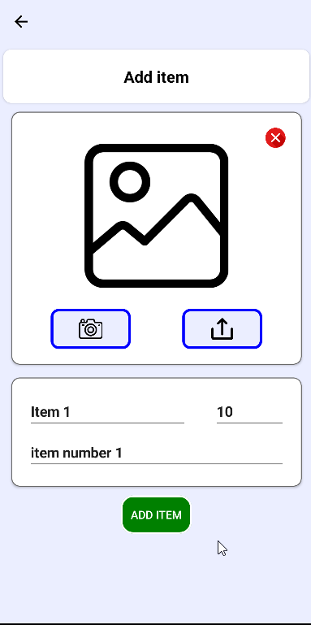
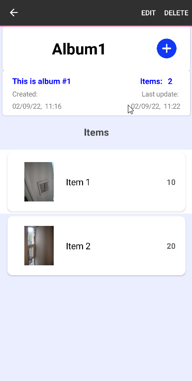

# Archiver - Documentation

## Creator
Bekas Athanasios  
bekasath@gmail.com

## Introduction

### Document purpose
This document provides an overview of the *Archiver* android application. It includes code explanation and user guide manual.

### Target Audience
This document is targeted to:
* Developer
* User (only the user manual)

### System Environment
* Development: Xamarin Forms - Visual Studio 2022
* Database Management: Sqlite

### Design Patterns
**Presentation Layer.** The pattern that app follows is MVVM.  
**Data Layer.** The datais managed by Sqlite.

## Class Diagram

## Data Dictionary

## User Manual
### Home Page
Home page contains a list of user's albums

### New Album

A new ablum can be added by clicking "+" on top right corner. Input Name and descrption and click add album to save the album. Name is required.

### Edit/Delete Album
In the album list hold an album so you can delete or edit an album.

### Item list
When an album is clicked user can see a list of items that belong to the album.

### New Item
A new item can be added by clicking "+" on top right corner. Upload or take a new photo for Item image. Input Name, descrption and quantity of the Item and click add to save the item. Name is required.

### Edit/Delete Item
In the item list hold an item so you can delete or edit an item.

### Create date/Update date changes 
After an album or an item is added or edited the create and update date changes.

### Help/Info
At the bottom of the home page you can click info icon for contact info and Help icon for help

   
**Bekas Athanasios**  
bekasath@gmail.com  
*Software Developer*

